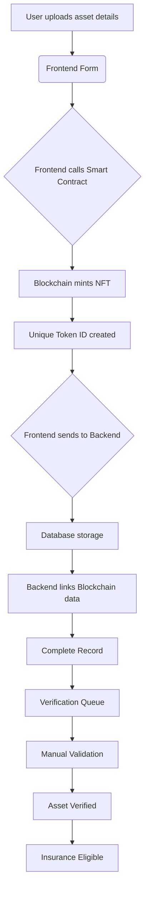
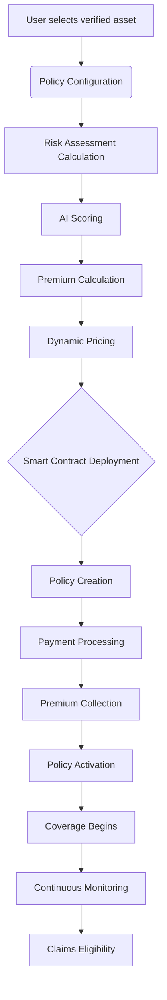
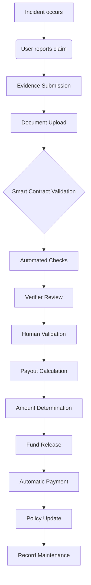

# InsureGenie - Real-World Asset (RWA) Insurance Platform

## 🌟 Overview

InsureGenie is a groundbreaking Real-World Asset (RWA) Insurance Platform that seamlessly integrates traditional insurance with cutting-edge blockchain technology. Our mission is to revolutionize the insurance industry by providing transparent, automated, and globally accessible coverage for physical assets through the power of smart contracts and decentralized processing.

### The Problem InsureGenie Solves

- **Traditional insurance is slow, opaque, and centralized**: InsureGenie brings efficiency and clarity
- **Real-world assets lack proper digital representation**: We create immutable digital twins for physical assets
- **Claims processing is manual and prone to disputes**: We automate and verify claims with cryptographic proof
- **No global, trustless insurance marketplace**: InsureGenie offers a universally accessible, wallet-based platform

### Our Solution

- **Tokenized Real-World Assets**: Immutable ownership records on the blockchain
- **Smart Contract Insurance Policies**: Transparent and automated coverage
- **Decentralized Claims Processing**: Cryptographic proof and automated payouts
- **Global Accessibility**: Wallet-based authentication for worldwide reach

## 🏗️ System Architecture

InsureGenie is built with a robust, multi-layered architecture ensuring security, scalability, and efficiency.

### 🔗 Blockchain Layer (Smart Contracts)

Our core logic resides in a suite of Solidity smart contracts, ensuring trustless operations and data immutability.

#### Asset Registry Contract

- **Purpose**: Digital twin creation for physical assets
- **Functions**: 
  - `registerAsset()` (mints NFT)
  - `verifyAsset()` (authority validation)
  - `transferOwnership()` (secure changes)
  - `updateAssetValue()` (dynamic updates)
- **Data Structure**: Token ID, asset metadata, ownership history, verification status

#### Insurance Policy Contract

- **Purpose**: Automated insurance policy management
- **Functions**: 
  - `createPolicy()` (generates coverage)
  - `payPremium()` (monthly processing)
  - `calculateRisk()` (algorithm-based assessment)
  - `processClaim()` (automated validation)
- **Policy Structure**: Coverage amount, premium schedule, deductible, duration, risk factors

#### Claims Processing Contract

- **Purpose**: Transparent, automated claim resolution
- **Functions**: 
  - `submitClaim()` (file with evidence)
  - `validateEvidence()` (cryptographic proof)
  - `calculatePayout()` (algorithmic settlement)
  - `releaseFunds()` (automated distribution)
- **Claim Workflow**: Incident → Evidence Submission → Smart Contract Validation (with Oracles) → Conditions Check → Payout Calculation → Fund Release

### 🖥️ Backend Architecture (FastAPI)

The backend provides secure API access, manages data, and implements complex business logic.

#### Authentication & Authorization

- **System**: JWT-based authentication
- **Features**: 
  - Wallet signature verification
  - Token generation/validation
  - Role-based access control (user/verifier/admin)
  - Session management with refresh tokens
  - Message signing
  - Rate limiting
  - CORS protection

#### Database Layer (SQLAlchemy)

- **Core Models**: User, Asset, Policy, Claim, RiskAssessment, Verification
- **Relationships**: Defines connections between users, assets, policies, and claims

#### API Endpoints Structure

- **Dashboard**: 
  - `/api/dashboard/stats`
  - `/api/dashboard/portfolio`
  - `/api/dashboard/analytics`

- **Asset Management**: 
  - `POST /api/assets/`
  - `GET /api/assets/`
  - `PUT /api/assets/{id}`
  - `DELETE /api/assets/{id}`

- **Policy Management**: 
  - `POST /api/policies/`
  - `GET /api/policies/`
  - `PUT /api/policies/{id}/pay`
  - `GET /api/policies/{id}`

- **Claims Processing**: 
  - `POST /api/claims/`
  - `GET /api/claims/`
  - `PUT /api/claims/{id}/status`
  - `GET /api/claims/{id}`

#### Business Logic Layer

- **Risk Assessment Engine**: 
  - Location-based scoring
  - Asset vulnerability analysis
  - Historical claims data
  - External data integration (weather, crime)

- **Premium Calculation**: 
  - Risk score weighting
  - Asset value percentage
  - Market rate adjustments
  - Dynamic pricing

- **Verification System**: 
  - Document authenticity
  - Third-party validator network
  - Consensus-based approval
  - Fraud detection

### 🎨 Frontend Architecture (Next.js + React)

The intuitive user interface provides a seamless experience for managing assets and policies.

#### Wallet Integration

- **Web3 Connection**: 
  - MetaMask/WalletConnect
  - Multi-chain support (Ethereum, BlockDAG)
  - Transaction signing/broadcasting
  - Real-time balance monitoring

- **Authentication Flow**: Connect wallet → Sign message → Send signature to backend → Receive JWT → Authenticated session

#### State Management

- **React Context Providers**: AuthContext, WalletContext, InsuranceContext, ThemeContext
- **Custom Hooks**: `useWallet()`, `useAuth()`, `useInsuranceAPI()`, `useContracts()`

#### Component Architecture

- **Page Components**: DashboardOverview, MyAssets, MyPolicies, Claims, RegisterAsset
- **Shared Components**: ConnectButton, NavBar, LoadingStates, ErrorBoundaries

- **Data Flow Pattern**: User Action → Component Event → Custom Hook → API Service → Backend Request → Database Query → Response → State Update → UI Re-render

## 🔄 System Integration Flows

### Asset Registration Process



### Insurance Policy Creation



### Claims Processing Workflow



## 💡 Key Innovations

### Dual Registration System

- **Blockchain**: Immutable ownership proof
- **Database**: Rich metadata and business logic
- **Benefits**: Decentralized trust + centralized efficiency

### Hybrid Claims Processing

- **Smart Contracts**: Automated validation
- **Human Verification**: Complex case handling
- **AI Risk Assessment**: Fraud detection

### Dynamic Risk Pricing

- **Real-time data**: Weather, crime, market conditions
- **Machine learning**: Historical pattern analysis
- **Personalized rates**: Individual risk profiles

### Cross-Chain Compatibility

- **Multi-blockchain support**: Ethereum, BlockDAG, others
- **Unified interface**: Single frontend for all chains
- **Interoperability**: Asset transfers between chains

## 🎯 Business Model

InsureGenie is designed with a sustainable business model in mind, providing value to all participants in the ecosystem.

### Revenue Streams

- Premium commissions (percentage of policy payments)
- Transaction fees (smart contract interactions)
- Verification services (asset validation)
- API licensing (third-party integrations)

### Value Propositions

- **For Users**: Transparent, fast, global insurance
- **For Insurers**: Reduced fraud, automated processing
- **For Verifiers**: New income opportunity
- **For Developers**: Robust insurance infrastructure API

## 🚀 Technical Advantages

- **Transparency**: All policies stored on public blockchain, immutable claim history, open-source smart contracts
- **Automation**: Reduced manual processing, faster claim settlements, lower operational costs
- **Global Accessibility**: No geographic restrictions, 24/7 availability, wallet-based access
- **Programmable Money**: Automated premium collection, instant claim payouts, conditional logic execution

## 🚀 Getting Started

To run InsureGenie locally, follow these steps:

### Prerequisites

- Node.js (for frontend)
- Python 3.x (for backend)
- npm (Node Package Manager)
- uvicorn (Python ASGI server)

### Backend Setup

1. **Clone the repository:**
   ```bash
   git clone https://github.com/sinhaparth5/rwa-insurance.git
   cd rwa-insurance
   ```

2. **Install Python requirements:**
   ```bash
   pip install -r requirements.txt
   ```
   *(If you don't have requirements.txt, you'll need to pip install fastapi sqlalchemy uvicorn and any other libraries your backend uses.)*

3. **Initialize the database:**
   ```bash
   python scripts/init_db.py
   ```

4. **Run the backend server:**
   ```bash
   uvicorn app.main:app --host 0.0.0.0 --port 8000
   ```

   The backend should now be running on http://localhost:8000.

### Frontend Setup

1. **Navigate to the frontend directory:**
   ```bash
   cd frontend # Assuming your frontend code is in a 'frontend' directory
   ```

2. **Install frontend dependencies:**
   ```bash
   npm install
   ```

3. **Build the frontend application:**
   ```bash
   npm run build
   ```

4. **Start the frontend application:**
   ```bash
   npm run start
   ```

   The frontend should now be running, typically on http://localhost:3000 (or another port if configured).