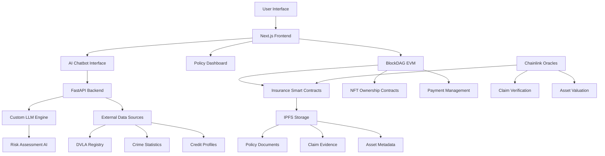
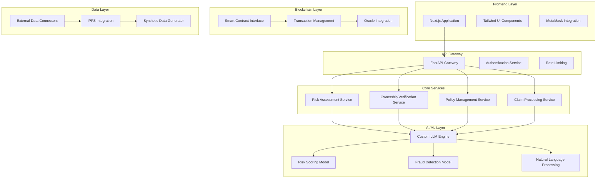
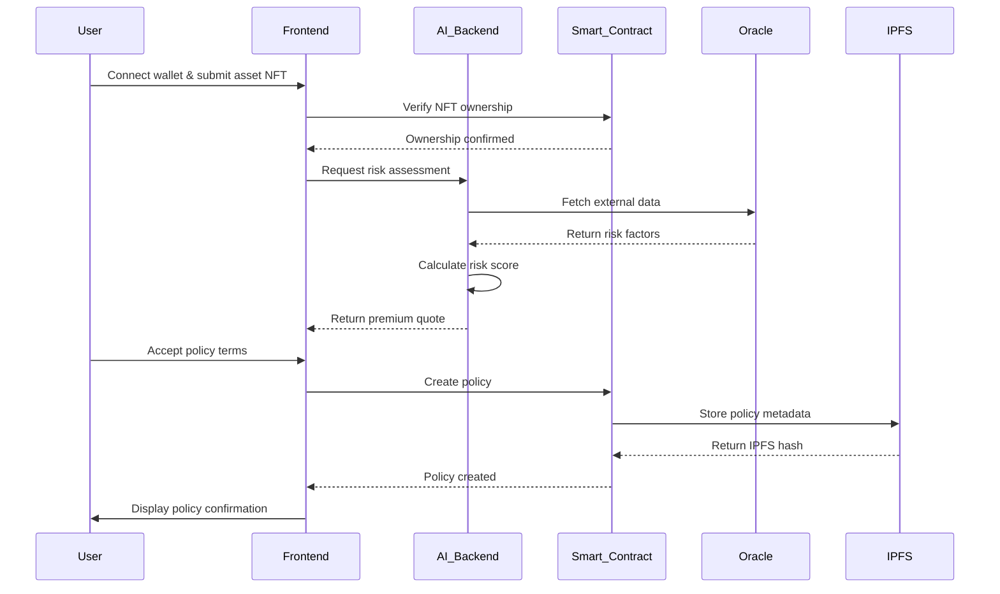
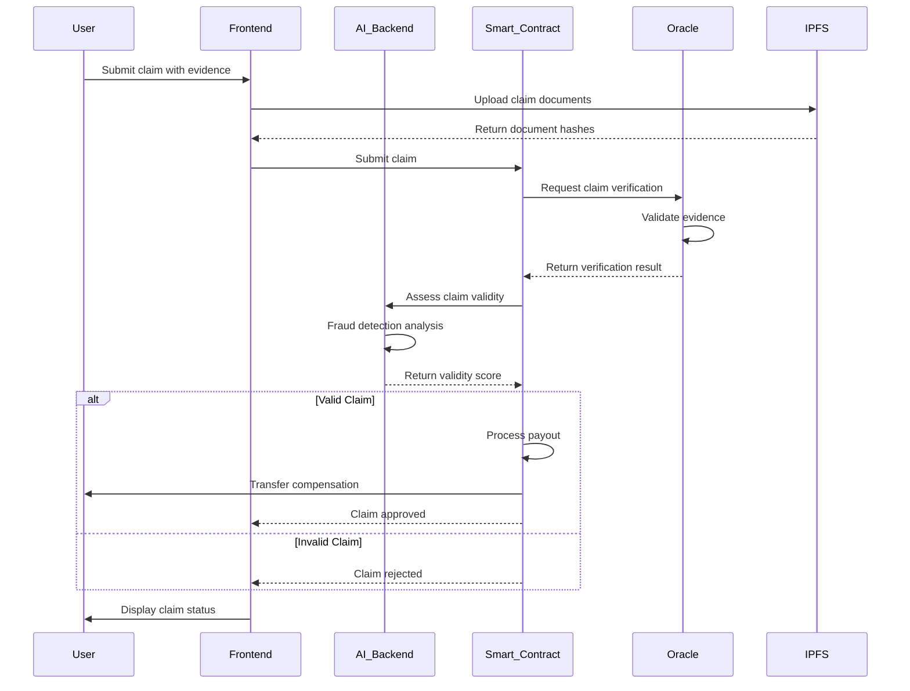

# AI-Powered RWA Insurance Protocol
## Decentralized Insurance for Tokenized Real-World Assets on BlockDAG

**Version 1.0**  
**Date: July 2025**

---

## Abstract

The tokenization of real-world assets through NFTs has unlocked unprecedented opportunities for fractional ownership, enhanced liquidity, and innovative financial products. However, the insurance ecosystem for these tokenized assets faces several fundamental challenges:

**Ownership Verification Crisis**: Traditional insurance relies on centralized verification systems, but tokenized assets require verification that the NFT holder is the legitimate owner of the physical asset. This creates a trust gap that existing systems cannot adequately address.

**Risk Assessment Complexity**: Evaluating risk for tokenized RWAs requires synthesizing diverse data sources including on-chain transaction history, off-chain asset conditions, geographical risk factors, and market dynamics. Traditional insurance models lack the sophistication to process this multidimensional data effectively.

**Claim Processing Inefficiency**: Current insurance claim processes are manual, time-consuming, and prone to fraud. The tokenized asset space demands automated, transparent, and verifiable claim processing mechanisms.

### 1.2 Market Opportunity

The global insurance market exceeds $5 trillion annually, while the tokenized asset market is projected to reach $10 trillion by 2030. The intersection of these markets represents a significant opportunity for innovation. Our protocol targets high-value asset categories including:

- **Automotive Assets**: Classic cars, luxury vehicles, and commercial fleets
- **Real Estate**: Tokenized properties and real estate investment trusts
- **Art and Collectibles**: Fine art, rare collectibles, and cultural artifacts
- **Industrial Assets**: Machinery, equipment, and infrastructure components

---

## 2. Technical Architecture

### 2.1 System Overview

Our protocol employs a hybrid architecture combining blockchain-based smart contracts, AI-driven risk assessment, and oracle-based external data integration. The system is built on BlockDAG's EVM-compatible blockchain, leveraging its unique UTXO + EVM hybrid design for enhanced transparency and auditability.

### 2.2 Microservices Architecture

The protocol employs a modular microservices architecture to ensure scalability, maintainability, and fault tolerance:

---

## 3. Core Components

### 3.1 Ownership Verification System

The ownership verification system employs a dual-layer approach combining on-chain and off-chain verification mechanisms:

**On-Chain Verification**:
- ERC-721 NFT ownership validation on BlockDAG
- Smart contract-based ownership history tracking
- Immutable ownership records with timestamp verification
- Multi-signature validation for high-value assets

**Off-Chain Verification**:
- Integration with government registries (DVLA for vehicles)
- Document verification through OCR technology
- Cross-referencing physical asset identifiers (VIN, property deeds)
- Biometric and identity verification for enhanced security

The system generates a confidence score (0-100) based on the correlation between on-chain NFT ownership and off-chain physical asset ownership. Policies are only created when the confidence score exceeds the minimum threshold (typically 80/100).

### 3.2 AI-Driven Risk Assessment

Our custom Large Language Model (LLM) processes multidimensional risk factors to generate comprehensive risk assessments:

**Data Sources Integration**:
- **On-Chain Data**: NFT transaction history, wallet reputation, staking behavior
- **Off-Chain Data**: Crime statistics, weather patterns, economic indicators
- **Asset-Specific Data**: Condition reports, maintenance records, market valuations
- **Geographical Data**: Location-based risk factors, regulatory environment

**Risk Scoring Algorithm**:
The AI model employs advanced machine learning techniques including:
- Natural Language Processing for document analysis
- Time-series analysis for trend prediction
- Ensemble learning for robust risk quantification
- Continuous learning from claim outcomes

**Dynamic Premium Calculation**:
Premiums are calculated in real-time based on:
- Base risk assessment score
- Market volatility indicators
- Seasonal risk adjustments
- Portfolio diversification benefits

### 3.3 Smart Contract Architecture

The protocol employs several interconnected smart contracts:

**Insurance Policy Contract**:
- Policy creation and management
- Premium payment processing using ERC-948 standard
- Coverage terms and conditions enforcement
- Beneficiary management and updates

**Claim Processing Contract**:
- Automated claim submission and validation
- Oracle-based evidence verification
- Multi-stage approval workflow
- Automatic payout distribution

**Asset Registry Contract**:
- NFT-to-physical asset mapping
- Ownership history tracking
- Asset valuation updates
- Transfer and succession management

---

## 4. Process Workflows

### 4.1 Policy Creation Sequence

### 4.2 Claim Processing Sequence

---

## 5. Economic Model

### 5.1 Token Economics

The protocol operates using a multi-token system:

**Primary Payment Tokens**:
- **RWA-GBP**: Stablecoin pegged to British Pound for UK operations
- **RWA-USD**: Stablecoin pegged to US Dollar for international operations
- **BDAG**: Native BlockDAG tokens for protocol governance and rewards

**Premium Payment Structure**:
- Monthly recurring payments using ERC-948 standard
- Automatic payment scheduling with grace periods
- Multi-token payment options for user flexibility
- Penalty mechanisms for late payments

**Claim Payout Mechanism**:
- Instant stablecoin payouts upon claim approval
- Graduated payout schedules for partial claims
- Bonus rewards for claim-free periods
- Fraud prevention through delayed payouts for suspicious claims

### 5.2 Incentive Mechanisms

**Policyholder Incentives**:
- Premium discounts for long-term policies
- Loyalty rewards for claim-free periods
- Referral bonuses for new policy acquisitions
- Governance token rewards for protocol participation

**Validator Incentives**:
- Oracle operators receive fees for data provision
- Claim validators earn rewards for accurate assessments
- Smart contract auditors receive ongoing compensation
- Community moderators earn governance tokens

---

## 6. Security and Compliance

### 6.1 Security Framework

**Smart Contract Security**:
- Comprehensive audit by leading security firms
- Formal verification of critical contract functions
- Multi-signature requirements for administrative functions
- Upgradeability mechanisms with community governance

**Data Security**:
- End-to-end encryption for sensitive data
- Zero-knowledge proofs for privacy protection
- Decentralized storage using IPFS
- Regular security assessments and penetration testing

**AI Model Security**:
- Adversarial training to prevent manipulation
- Model versioning and rollback capabilities
- Continuous monitoring for bias and drift
- Secure model deployment and inference

### 6.2 Regulatory Compliance

**Insurance Regulations**:
- Compliance with local insurance regulations
- Regular reporting to regulatory authorities
- Capital adequacy requirements through community treasury
- Consumer protection mechanisms

**Data Protection**:
- GDPR compliance for European operations
- Data minimization and purpose limitation
- User consent management systems
- Right to erasure implementation

**Anti-Money Laundering**:
- KYC/AML procedures for high-value policies
- Transaction monitoring and suspicious activity reporting
- Sanctions screening and compliance
- Regular compliance audits and updates

---

## 7. Implementation Roadmap

### 7.1 Phase 1: Foundation (Months 1-3)
- Core smart contract development and testing
- AI model training with synthetic and real-world data
- Frontend interface development with Tailwind CSS
- Basic integration with BlockDAG testnet

### 7.2 Phase 2: Integration (Months 4-6)
- Oracle integration for external data sources
- Advanced AI model deployment and optimization
- Security audits and penetration testing
- Beta testing with select users

### 7.3 Phase 3: Launch (Months 7-9)
- Mainnet deployment on BlockDAG
- Partnership establishment with asset tokenization platforms
- Marketing and user acquisition campaigns
- Community governance implementation

### 7.4 Phase 4: Expansion (Months 10-12)
- Multi-chain deployment support
- Additional asset category integration
- Advanced analytics and reporting features
- International market expansion

---

## 8. Risk Analysis and Mitigation

### 8.1 Technical Risks

**Smart Contract Vulnerabilities**:
- *Mitigation*: Comprehensive auditing, formal verification, and bug bounty programs

**Oracle Manipulation**:
- *Mitigation*: Multiple oracle sources, consensus mechanisms, and dispute resolution

**AI Model Bias**:
- *Mitigation*: Diverse training data, continuous monitoring, and model retraining

### 8.2 Market Risks

**Regulatory Changes**:
- *Mitigation*: Proactive compliance monitoring and adaptive protocol design

**Market Volatility**:
- *Mitigation*: Stablecoin payouts, dynamic premium adjustments, and hedging strategies

**Competition**:
- *Mitigation*: Continuous innovation, strategic partnerships, and community building

### 8.3 Operational Risks

**Scalability Challenges**:
- *Mitigation*: Microservices architecture, layer-2 solutions, and performance optimization

**User Adoption**:
- *Mitigation*: Intuitive user interface, comprehensive education, and incentive programs

**Data Quality**:
- *Mitigation*: Multiple data sources, validation algorithms, and quality metrics

---

## 9. Conclusion

The AI-Powered RWA Insurance Protocol represents a paradigm shift in how we approach insurance for tokenized real-world assets. By combining advanced artificial intelligence, blockchain technology, and decentralized finance principles, we create a transparent, efficient, and trustworthy insurance ecosystem.

Our protocol addresses the fundamental challenges of ownership verification, risk assessment, and claim processing while providing a seamless user experience. The use of BlockDAG's unique UTXO + EVM architecture ensures both transparency and flexibility, making it an ideal platform for insurance applications.

As the tokenized asset market continues to grow, our protocol is positioned to become the standard for RWA insurance, enabling broader adoption of asset tokenization and contributing to the evolution of the digital economy.

The success of this protocol depends on continued innovation, community engagement, and regulatory compliance. We are committed to building a sustainable, scalable solution that serves the needs of asset owners, investors, and the broader DeFi ecosystem.

---

## References

1. BlockDAG Technical Documentation
2. ERC-721 Non-Fungible Token Standard
3. ERC-948 Subscription Token Standard
4. Chainlink Oracle Network Documentation
5. IPFS Protocol Specification
6. Insurance Industry Statistical Reports
7. Tokenized Asset Market Research
8. Decentralized Finance Security Best Practices

---

**Disclaimer**: This whitepaper is for informational purposes only and does not constitute investment advice. The protocol is under development and subject to changes based on technical requirements and regulatory considerations.